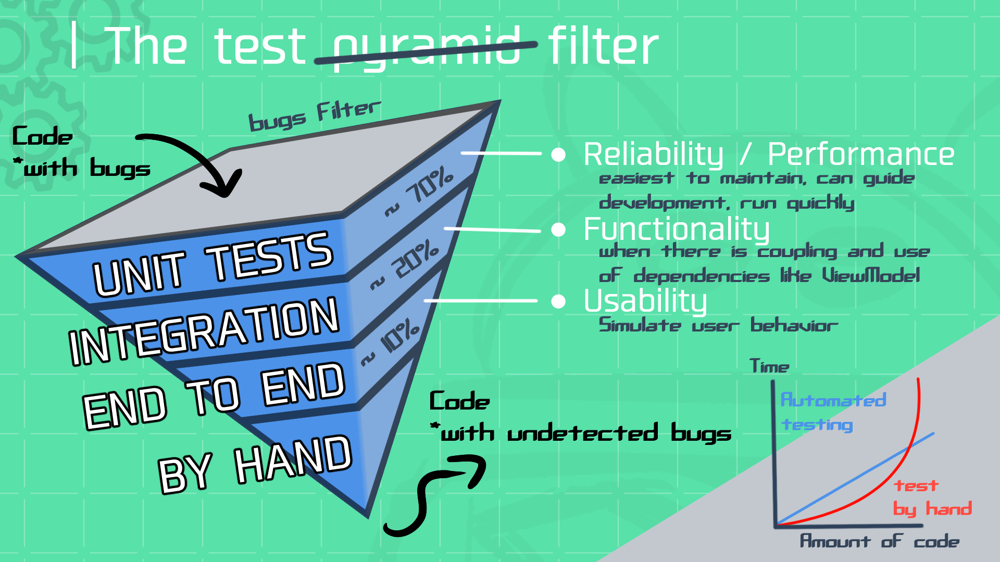
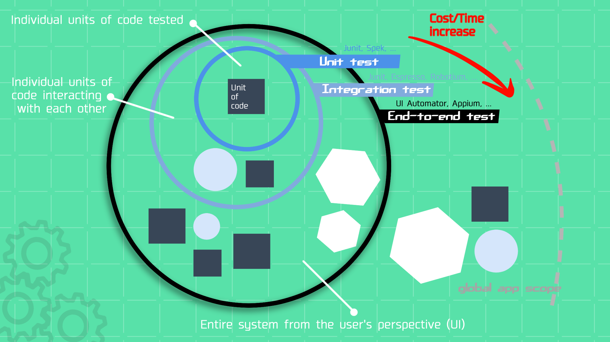
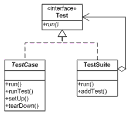

# INTRODUCTION


As your application (or the Android ecosystem!) continues to evolve with new devices, operating system versions, refactoring, new features, and expanding teams, delivering high-quality, bug-free applications can be difficult.

This is precisely where automated testing plays a pivotal role. By employing specialized tools such as frameworks, libraries, and scripts, we systematically test app's functionalities, performances, and user interfaces, ensuring that our app is working across a wide range of scenarios.

For this introduction, I'll use the 'Why/What/When/How' method as our guiding compass to understand **why** dedicating time to coding automated tests is crucial, **what** they entail, **when** and at what frequency it's beneficial to employ them, and **how** to effectively implement automated test in your project.

## WHY
> Automated testing is a valuable tool for:

- [x] **Efficiency and accuracy:** *unlike manual testing, which can be time-consuming and error-prone, they offer efficiency (they are only written once) and accuracy in identifying and resolving issues.*
- [x] **Reliability and scalability:** *they can be run systematically to verify that code functions are working as expected across a wide range of devices and operating system versions.*
- [x] **Confidence:** *like a safety net, they can give developers confidence when making modifications/refactoring to the codebase.*
- [x] **Documentation:** *they can serve as a form of documentation, illustrating the expected behavior of the code.*

> [!NOTE]
> On a more rational ground, testing your Android app can help ensure the reliability of core functions, safeguard your business's success, manage complexity effectively, ensure adaptability to changes, and deliver a seamless user experience.

## WHAT

### ⦿ Testing Process:
- Set Up Testing Environment:
    - Configure emulator or connect physical devices.
    - Include external binaries with dependencies[^1].
- Create Test Cases:
    - If needed, refactor your code to facilitate testing.
    - Write test cases for unit, integration, and UI tests.
- Test Execution:
    - Run tests using Android Studio, Framework[^2] and Gradle.
    - Observe test reports.
### ⦿ Type and Scope:      


 ### ⦿ Test Structure for unit and integration test:
 - Test Setup:
    - Initial state or environment for the test case.
    - Settings for any necessary data, configurations, or conditions.
- Action:
    - Execute the function, interaction, or process under examination.
- Assertions:
    - Define assertions to verify the expected results or outcomes.
    - Check whether the actual results match the expected results.
    - Evaluate whether the test case passes or fails based on the assertions.
- Teardown:
    - Destroy the created data / setup (each test need to be independent)  
 


## WHEN
| Type of test  | Purpose | Platform | Execution speed | Frequency | Complexity | Maintainability |
| ------------- | ------------- | ------------- | ------------- | ------------- | ------------- | ------------- |
| Unit tests  | To verify the outcome of a function/method (check what a single unit of code do, not how)  | Java Virtual Machine | Fast | Per commit/pull request | Low | High |
| Integration tests  | To verify the communication between the system (class/app/viewmodel/database), how several units interact with each other | JVM / Android  | Medium | Per pull request/nightly | Medium | Medium |
| End-to-end tests  | To simulate a user behavior/path fully, verifies that the system can be used to complete real-world tasks from start to finish | Android  | Slow | Nightly/pre release | High | Low |

> [!NOTE]
> - End-to-end test (and some integration test) are also called Instrumented test because they require an Android emulator or physical device to interact with the UI / Android SDK components of the app.
> - Remember that automated testing is an ongoing process, and it's essential to continuously improve and adapt your testing strategy as your Android app evolves.
> -  When using third-party libraries, you may not need to extensively test the library's functionality since it's the responsibility of the library authors to ensure its correctness.

## HOW
# Rules to make a good test in Android development:

### 1. Independent, repeatable and precise:
Tests should be able to run in any order and individually without causing any unexpected outcomes. This avoids flaky tests that fail intermittently due to side effects from other tests. The responsibility for its failure should be also clear and easy to identify ( at least for unitTest ^^' ).

### 2. Clear and concise:
Like the application itself, tests need to be clear, concise, and easy to read, with good indentation, documentation and descriptive naming [conventions](https://medium.com/@stefanovskyi/unit-test-naming-conventions-dd9208eadbea).

```kotlin
@Test
fun `myMethod should return the sum of given parameter`() {
// 1 – GIVEN
    val myParam1 = 3
    val myParam2 = 4
// 2 – ACTION
    myClassToTest.send(myParam1, myParam2)
    val sum = myClass.getSum()
// 3 - ASSERTION
    assertThat(sum).isEqualTo(7)
}
```

### 3. Test all possible scenarios:
Test expected and unexpected scenarios. Test coverage should be as broad as possible:
- **Edge cases:** scenarios that occur outside of the normal range of inputs and behaviors.
- **Mutation testing:** it's a type of software testing that involves generating small changes (called mutants) to the code under test and then executing the test suite to see if the mutants are detected and cause a test failure. It can help to identify areas where the test suite needs to be improved or catch bugs that might not be caught by other types of testing.
- **Monkey test:** the software is tested by providing random inputs and checking the behavior, or seeing whether the application or system will crash.

### 4. Speed:
The speed of testing is an important factor to consider when developing a testing strategy. Obviously, the quicker the tests are, the better.

### 5. Use a testing framework. 



A testing framework provides a number of features that can help you write and run tests more efficiently. It also helps you organize your tests into logical groups and identify areas of your code that are not covered by tests (with coverage).

### 6. Use continuous integration (CI)
Run your tests automatically. CI can help you to catch bugs early and often, before they make it into production.

> [!IMPORTANT]
> It's also crucial to prepare your application code to be testable:
> - Separate pure logic code from Android SDK code related (for exemple avoid using context in ViewModel) with modern architecture (MVVM/MVI).
> - Write high-cohesion[^3], low-coupling[^4] code.
> - Use abstract / interface code and dependency injections (when coupling is necessary).
> - Test-Driven Development (TDD[^5]) can help you prepares/drive the app for testing but also aids in writing the unit itself (especially valuable for complex functions) and think about edge cases.

[^1]: Dependencies are pieces of code that are used to extend or enhance the capabilities of a project. (testImplementation for unitTest / androidTestImplementation for Instrumented test)
[^2]: A test automation framework is a set of guidelines, tools, and [libraries](https://github.com/MattAzerty/MyAutomatedTestCheatSheet/blob/main/docs/introduction/liblist.md) that help testers automate their testing process. (e.g., JUnit)
[^3]: High cohesion means that a class or module should be focused on a single task or responsibility.
[^4]: Low coupling means that classes or modules should be as independent of each other as possible.
[^5]: Tests are written before implementing the method itself, with its signature in mind.
