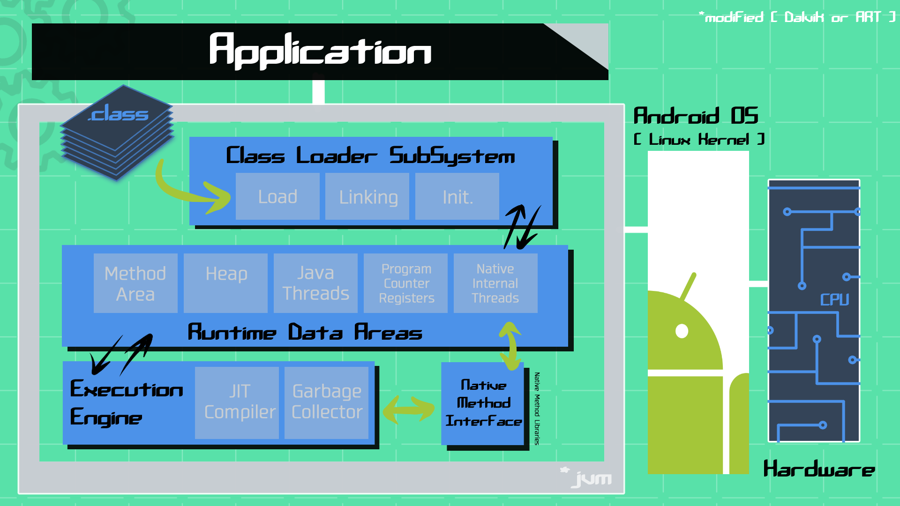
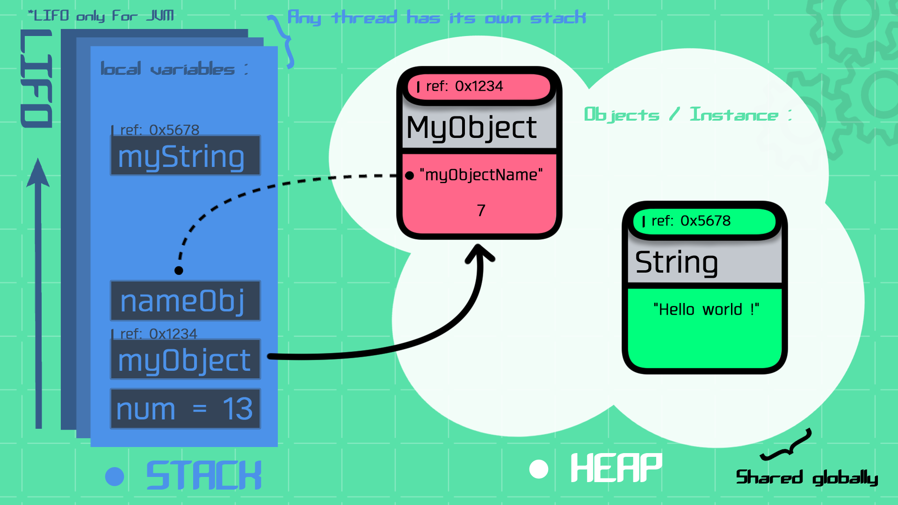

# LOCAL TESTING

## Java Virtual Machine


Java was designed with the idea of "Write Once, Run Anywhere" (WORA) in mind. This means that once you write your source code in Java (in a .java/.kt file), you can compile it into bytecode (.class file). This bytecode can then be executed, or run, on any platform that has a Java Virtual Machine (for android, runtime are [ART or Dalvik](https://source.android.com/docs/core/runtime)[^1] with use of .dex files).

### ■ Classloader:

Classloaders are responsible for loading compiled Java classes into memory at runtime:

1. Class file are loaded into memory.
2. The classloader verifies the class file to make sure that it is valid.
3. Then links the class file to other classes that it depends on.
4. Allocates memory for the class's static variables.
5. Initializes the static variables.
6. Executes the static code.
   
Once the class's static variables and static code[^2] have been initialized, the class is ready to be used. This means that instances of the class can be created and used by the program.

### ■ Runtime Data:

Runtime Data is responsible for all program data such as:

  - **Method Area:** it's a shared data area where the class-level datas are stored, including static variables, class and interface definitions. The method area is created when the JVM starts up and is destroyed when the JVM exits.
  - **Heap Area:** allows global access and data stores (Objects, Arrays) available to all threads[^3] during the lifetime of the application. Since the Method and Heap areas share memory for multiple threads, it's not thread-safe (concurency issue(s) can happen, leading to flacky behavior).The heap is created when the JVM starts up and is destroyed when the JVM exits.
  - **Stack Area:** it's a thread-local data area that stores method call frames (data structure that contains information about a method, such as the method's parameters, local variables[^4], and return value). The stack is created when a thread is created and is destroyed when the thread exits.
  - **PC Registers:** contain the program counter, which is a pointer to the next instruction that the JVM will execute. Each thread has its own PC register.

### STACK VS HEAP:

```kotlin

fun main() {

  val num = 13 //Primitive types are stored on the stack not on the heap.
  val myObject = MyObject("myObjectName", 7)
  val nameObj = myObject.name
  val myString = "Hello world !"

}/* When the main() function finishes executing, all local variables are removed from the stack
 and any objects that were referenced by those variables become eligible for garbage collection.*/

data class MyObject(val name: String, val id: Int)

```



> [!WARNING]
> The stack memory is smaller compared to Heap memory and can throw the famous "StackOverflowError".
> The heap memory (RAM dependent) is the most critical area when it comes to memory leaks ("OutOfMemoryError").
> - Avoid sharing mutable objects between threads. If you must share a mutable object, make sure to protect it with synchronization.
> - Use immutable objects whenever possible. Immutable objects cannot be changed once they are created, so they are inherently thread-safe.
> - Be careful with concurrent modifications. If you are modifying a data structure while another thread is iterating over it, you may need to use synchronization to prevent data corruption.

### ■ Execution Engine:

The execution engine is the component responsible for executing Java bytecode (Assigned by the Runtime Data Area).
When you compile Java source code, it gets converted into platform-independent bytecode instructions then executed piece by piece:

- **Interpreter:** It reads the byte code _(must contain a `main()` method!)_ and interprets (convert) into the machine code (native code). Then executes it in a sequential manner. However, interpretation can be slow because it's every time, even if it's the same method, which reduces the performance of the system. To overcome this problem JIT Compilers is introduced in 1.1 version.
- **JIT Compiler:** To improve performance, modern JVMs use a JIT (Just-In-Time) compiler. It identifies parts of the bytecode frequently executed and compiles them into native machine code, which is executed directly by the underlying hardware. This compiled code replaces the interpreted code, making the execution faster for these specific parts.[^5]
- **Garbage Collector:** This Java program, as a daemon thread[^6], continuously runs in the background, managing memory by clearing unreachable methods, hence freeing up heap memory automatically. It's a built-in mechanism of any JVM.

**Garbage Collection exemples:**

- Null Value
  
```Kotlin

class MyClass {
    var myArray = IntArray(10000)
}

fun main() {
    var obj = MyClass()

    // setting obj reference to null
    obj = null

    // The object is no longer accessible and becomes eligible for garbage collection
}

```

- Object References

```Kotlin

class MyClass {
    var myArray = IntArray(10000)
}

fun main() {
    var obj1 = MyClass()
    var obj2 = MyClass()
   
    // obj1 now refers to the same object as obj2
    obj1 = obj2
    
    // obj1's original object is no longer accessible and becomes eligible for garbage collection
}

```

- Memory Leaks

```Kotlin

class MyClass {
    var myArray = IntArray(10000)
}

fun main() {
    while (true) {
        val obj = MyClass()
        // The 'obj' variable is not set to null, and a new object is created each time the loop runs
    }
}
```


> [!WARNING]
> Memory leaks can easily occur in Android when AsyncTasks, Handlers, Singletons, Threads, and other components are used incorrectly.

## JUnit


### Annotations
| JUnit 4 Annotation | JUnit 5 Annotation | Description |
|--------------------|--------------------|-------------|
| @After             | @AfterEach          | The annotated method will be executed after each @Test method in the current class. |
| @AfterClass        | @AfterAll           | The annotated (static) method will be executed once after all @Test methods in the current class. |
| @Before            | @BeforeEach         | The annotated method will be executed before each @Test method in the current class. |
| @BeforeClass       | @BeforeAll          | The annotated (static) method will be executed once before any @Test method in the current class. |
| @Ignore            | @Disabled           | The annotated method will not be executed (it will be skipped) but reported as such. |
| @Test              | @Test               | No change from JUnit4. The annotated method is a test method. |

## Assertk
... in progress
## Test doubles
... in progress
## Suspending function testing
... in progress

[^1]: Each process in Android has its own Dalvik or ART registered based Virtual Machine instance (with registers to store operands and results) while the JVM is a stack based virtual machine ('simple' LIFO). This mean difference can exist when tests are deployed on instrumented devices VS local machine.
[^2]: Static variables and static code can be used to implement a variety of features, such as: Class-level configuration, Singleton objects, Utility classes, ...
[^3]: A thread is a lightweight process that can run concurrently with other threads. Threads share the same memory space as the process they belong to, but they have their own stack and program counter. This allows threads to run independently of each other, while still sharing data and resources.
[^4]: Local variables are variables that are declared inside a method or block.
[^5]: **HotSpot Optimization** by the JIT compiler continually improves frequently used methods. Each time a method hits a certain usage threshold, it gets recompiled with better optimizations. This process keeps repeating until the code is highly optimized. Also, **Code Caching** stores the optimized code for faster future executions.
[^6]: In Java, a daemon thread is a type of thread that runs in the background and provides support to non-daemon threads.

